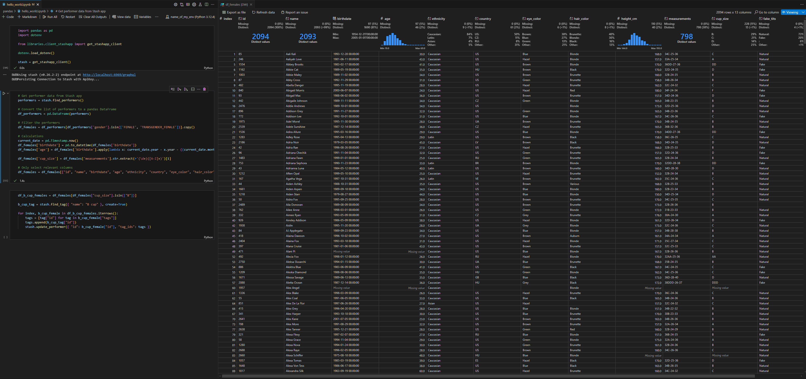
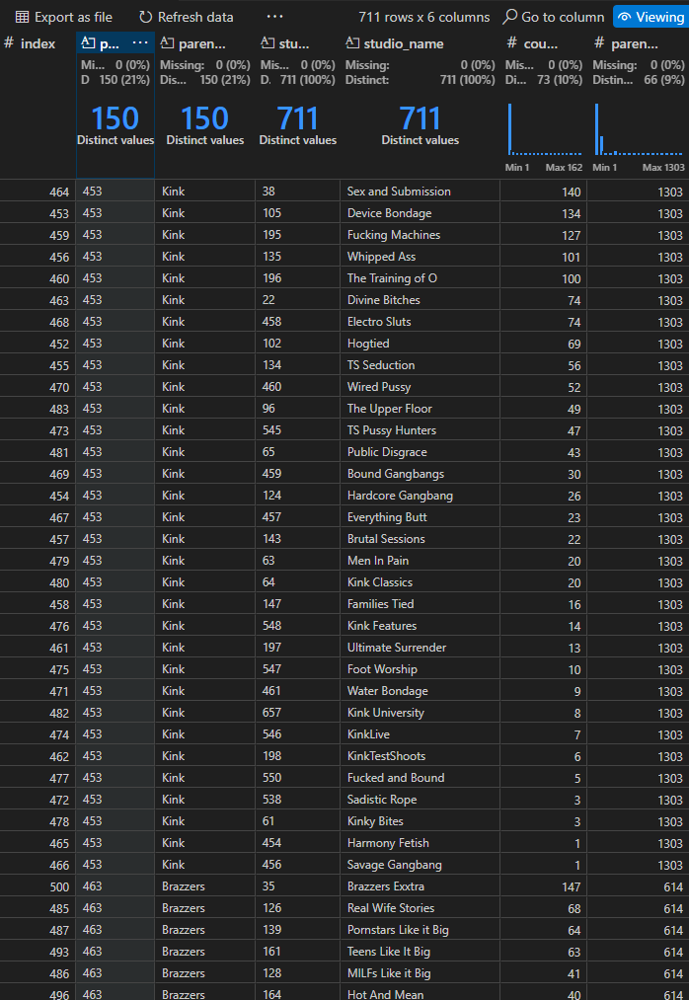
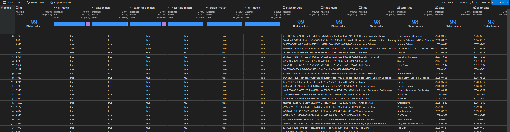

# Stash with Pandas

## 1. Environment file

.env file is a convenient place to store API keys and avoid having those in version controlled notebooks. Create .env file with your own API keys and other values:

```
cp env.sample .env
```

## 2. Install Python and related tools

### 2.1 Python and Pandas

Recommended: [Install Conda](https://conda.io/projects/conda/en/latest/user-guide/install/index.html) and create a new environment for it to keep Pandas separate from other Python environments.

```
conda create -c conda-forge -n name_of_my_env python pandas
conda activate name_of_my_env
```

Alternative: Install [Python](https://www.python.org/downloads/) and [Pandas](https://pandas.pydata.org/docs/getting_started/install.html).

### 2.2 pip packages

Install [stashapp-tools](https://github.com/stg-annon/stashapp-tools) and [dotenv](https://pypi.org/project/python-dotenv/):

```
pip install stashapp-tools python-dotenv
```

## 3. Install Visual Studio Code

Install [Visual Studio Code](https://code.visualstudio.com/) and following extensions:

- [Jupyter](https://marketplace.visualstudio.com/items?itemName=ms-toolsai.jupyter)
- [Python Debugger](https://marketplace.visualstudio.com/items?itemName=ms-python.debugpy)
- [Data Wrangler](https://marketplace.visualstudio.com/items?itemName=ms-toolsai.datawrangler)

## 4. Getting Started

After opening this repository in Visual Studio Code, remember to set correct kernel for Jupyter notebook: https://code.visualstudio.com/docs/datascience/jupyter-kernel-management

Now you can start experimenting with Stash and Pandas by looking at hello_world.ipynb.



# Notebooks

## Hello World

A handful of samples to get you going.

## Scene Matching

Tailored to a workflow where scenes have been matched to StashDB first and you want to match to TPDB without using TPDB's data directly.

Process is as follows:

1. Set TPDB_API_KEY value in .env file to your TPDB API key
2. Run initial cells to create Stash app connection and create utility functions
3. Run studio summary to figure out which networks have most scenes missing TPDB. Open `df_scenes_grouped_by_studio` in Data Wrangler.
4. Iterate following process
   1. Find studio with name
   1. Get 100 scenes at a time from Stash app
   1. Get TPDB matches with phash and get the best match in a single table
   1. Open `df_matched_scenes` in Data Wrangler
   1. Manually verify with Data Wrangler UI that scenes match as you expected
   1. Save TPDB UUIDs to your Stash app with one of the last cells. There are multiple examples based on if you are comfortable saving TPDB UUIDs only to those scenes which match all identifiers or if you want something more specific.




